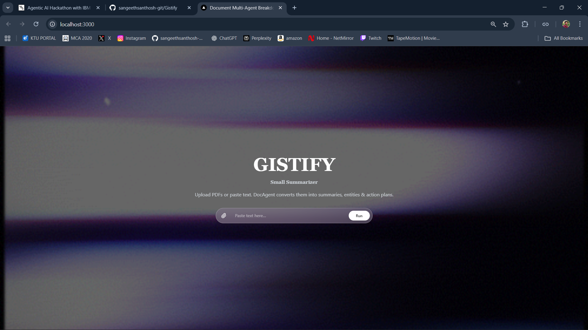
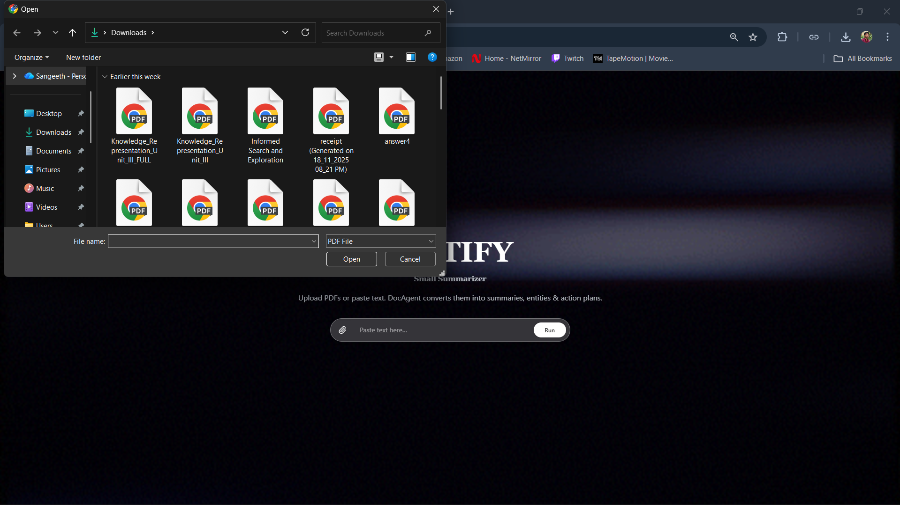
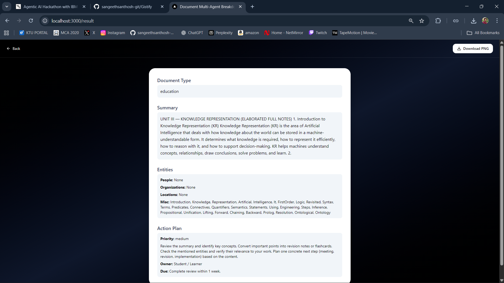
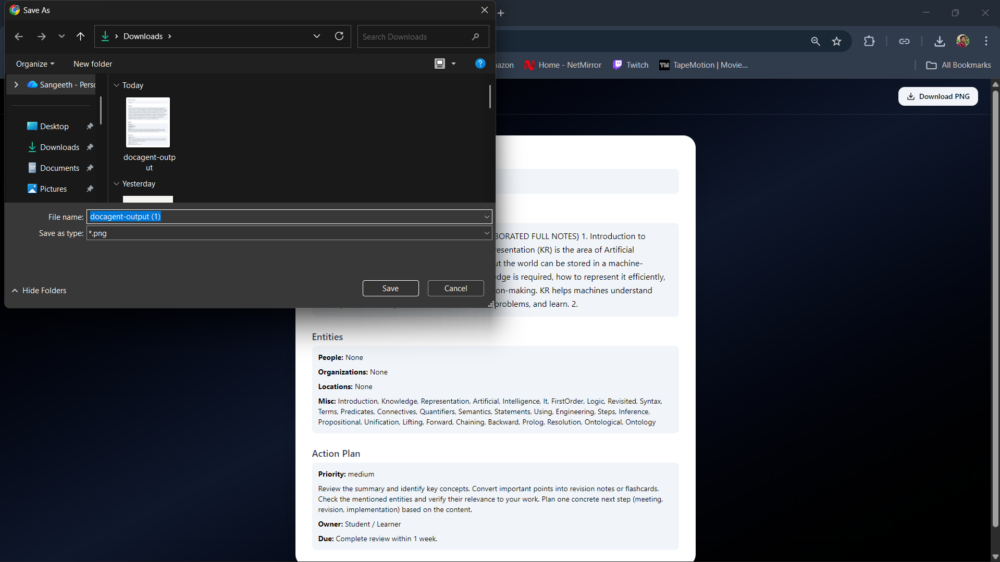

# 📘 Gistify – AI-Powered PDF & Text Summarizer

Transform long documents into clear, actionable insights.

Gistify is an elegant, fast, AI-powered document intelligence tool that converts PDFs and raw text into summaries, extracted entities, and action plans — all using a smooth, conversational interface.

Built for developers, students, researchers, and teams who deal with overwhelming documents every day.

## ✨ About the Project

Gistify helps users cut through information overload. Instead of reading dozens of pages, Gistify extracts the gist — the essence — in seconds.

You upload a PDF or paste text → Gistify analyzes it → and returns:

## 📸 Screenshots
### 🏠 Home Page

  
    

### 📤 Upload Document

  
   

### 📊 Analysis Result Page

  
   

### 📥 Download PDF

 
  

## 📄 Document Type Detection

🧠 Key Summary

🏷️ Named Entity Extraction

📝 Action Plan Recommendations

Everything is displayed in a smooth chat-like interface with beautiful transitions.

Perfect for:

Students reading textbooks

Professionals analyzing reports

Researchers summarizing papers

Product teams reviewing documentation

Anyone who wants the “TL;DR” instantly

## 💡 Key Features
## 🚀 Fast Multi-Agent Analysis

Runs multiple lightweight inference stages:

Heuristic document classifier

Extractive summarization

Simple entity recognition

Action plan generator

📎 PDF + Text Input

Upload full PDFs or paste any text snippet.

## 💬 Chat-Like Output Experience

Beautiful animated results page showing:

Summary bubble

Entity bubble

Action plan bubble

## 🎨 Elegant UI

Hero banner with GIF

Paperclip upload inside search bar

Smooth slide-up animations

Responsive for all devices

## 📥 Download as PDF

Export the results as a clean PDF.

## ⚡ Works with Free AI Models

Uses free HuggingFace inference endpoints + local heuristics.

## 🖥️ Tech Stack
Layer	Tech
Frontend	Next.js 14, React, TailwindCSS
Backend	Next.js API routes
AI Models	HuggingFace Transformers (free-tier)
PDF Parsing	pdf-parse
Export	jsPDF + html2canvas

## 📁 Folder Structure
/app
 ├─ page.tsx              # Home page with input bar
 ├─ result/page.tsx       # Output page with chat-style responses
 ├─ globals.css           # Tailwind styling
/api
 ├─ analyze/route.ts      # AI + parsing backend
/components
 ├─ ResultCard.tsx        # Reusable bubble container
/lib
 ├─ pdf.ts                # PDF parsing helper
/public
 ├─ hero.gif              # Hero banner animation
README.md

## ⚙️ Installation
1. Clone the repository
git clone https://github.com/sangeethsanthosh-git/gistify.git
cd gistify

2. Install dependencies
npm install

3. Run the dev server
npm run dev

## 🛠️ Environment Variables

Create a .env.local:

HF_API_KEY=your_huggingface_api_key

You can use a free HuggingFace key.

## 📤 Exporting Results

PDF download button inside /result/page.tsx converts the output section into a clean downloadable PDF using jsPDF.

## 🚀 Future Improvements

Chat history

Multi-document batch processing

OCR for scanned PDFs

Semantic search

Save to cloud folders

AI-powered rewrite tool

## 📣 Project Taglines

Choose one:

“Gistify – Your document, distilled.”

“From pages to clarity—instantly.”

“Summaries that feel effortless.”

“Understand more. Read less.”

“Your personal document intelligence agent.”

## 📜 License

MIT License — free to use, modify, and share.
